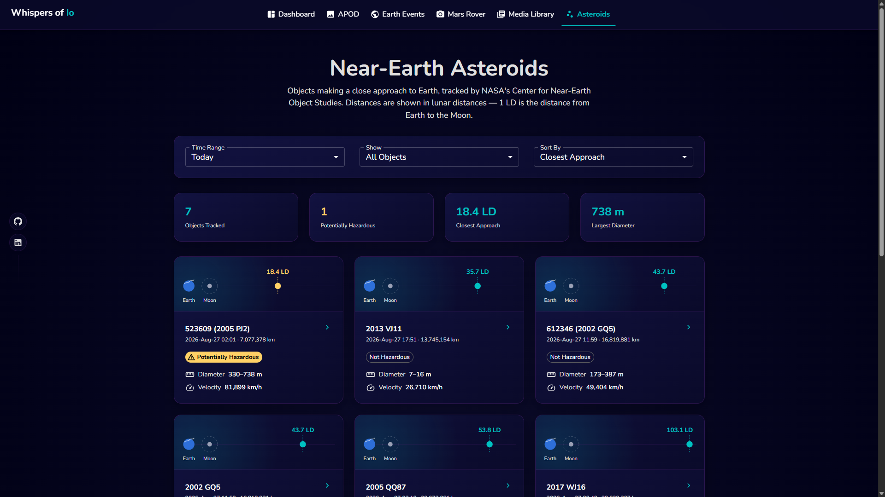
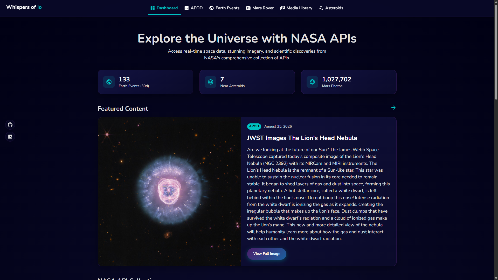
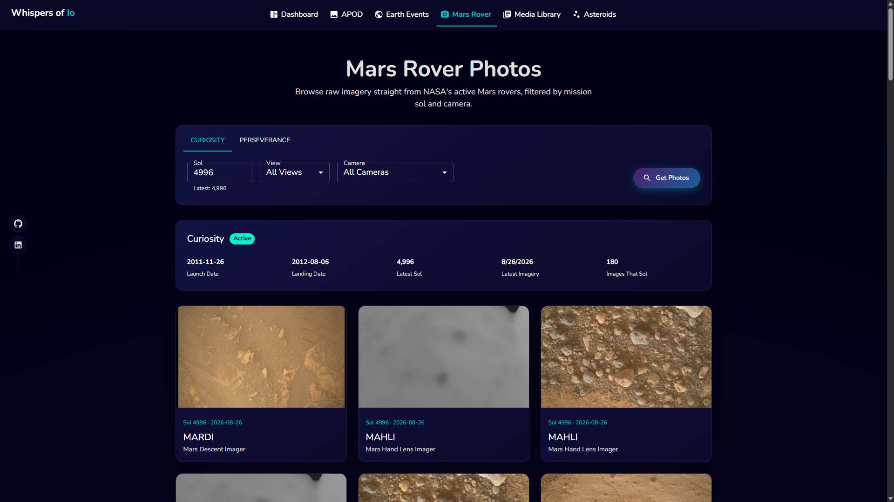
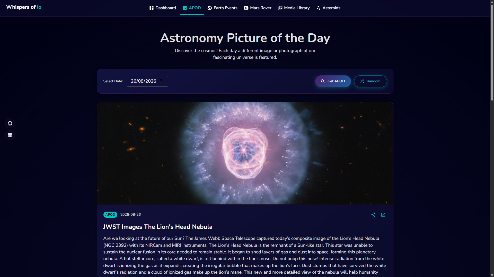
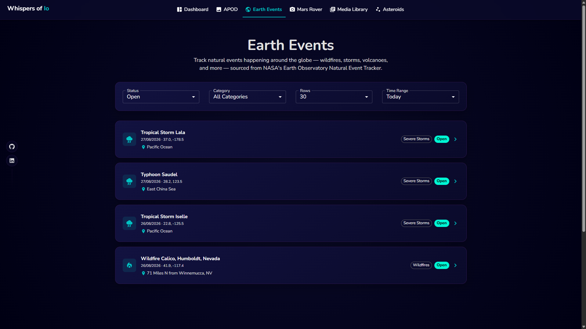

# Whispers of Io

Um dashboard para explorar os dados públicos da NASA — fotos astronômicas, rastreamento de eventos naturais em tempo real, imagens dos rovers em Marte, asteroides próximos à Terra e o acervo histórico de mídia da NASA — construído com Next.js, TypeScript e React Query sobre APIs reais da NASA.

**[Acessar a aplicação →](https://whispersofio.vercel.app/)**



<sub>Asteroides em aproximação, com um diagrama por card posicionando a Terra, a órbita da Lua e o objeto — em escala logarítmica, já que as distâncias entre um objeto e outro variam por ordens de grandeza.</sub>

---

## Índice

- [Sobre](#sobre)
- [Funcionalidades](#funcionalidades)
- [APIs e Integrações](#apis-e-integrações)
- [Stack Técnica](#stack-técnica)
- [Como Rodar](#como-rodar)
- [Scripts Disponíveis](#scripts-disponíveis)
- [Arquitetura](#arquitetura)
- [Notas de Engenharia](#notas-de-engenharia)
- [Interface](#interface)
- [Telas](#telas)
- [Limitações Conhecidas](#limitações-conhecidas)

---

## Sobre

O Whispers of Io exibe dados ao vivo de várias APIs abertas da NASA por trás de uma interface escura e consistente. Todas as telas estão ligadas a uma fonte de dados real — não há dado de exemplo por trás dos visuais.

O projeto também serve como demonstração de prática full-stack: arquitetura baseada em features, uma camada de dados tipada construída sobre React Query, proteção da chave de API e cache de respostas no servidor via Route Handlers do Next.js, e o hábito de verificar o comportamento de APIs de terceiros contra os serviços reais antes de construir em cima delas.

Todas as telas são renderizadas no servidor com os dados já embutidos e revalidação incremental, então chegam ao navegador prontas — sem spinner e sem refazer no navegador nenhuma busca que o servidor já tenha feito.

---

## Funcionalidades

### Dashboard
- Estatísticas ao vivo de eventos na Terra, asteroides próximos e imagens de Marte — cada uma resolve de forma independente, então uma fonte com falha nunca bloqueia as demais
- Foto Astronômica do Dia em destaque, imagem ou vídeo
- Atividade recente de eventos na Terra, cada linha identificando a categoria do evento por ícone e rótulo e levando à sua própria página de detalhes
- Miniaturas das APODs recentes

### Foto Astronômica do Dia (APOD)
- Navegação por data (limitada ao intervalo do acervo) ou sorteio de uma entrada aleatória
- Suporte a imagens, vídeos `mp4` diretos e embeds do YouTube
- Link para a resolução máxima, cópia de link para compartilhar e acesso à página original da APOD
- Estatísticas do acervo derivadas do feed ao vivo

### Eventos na Terra
- Eventos naturais ao vivo da NASA EONET — incêndios florestais, tempestades, vulcões, enchentes e mais
- Filtros de aplicação instantânea por status, categoria, número de linhas e intervalo de tempo, com barra de progresso enquanto o resultado é buscado
- Categorias sem eventos correspondentes se ocultam automaticamente
- Quando o EONET aplica limite de taxa, a tela espera e tenta de novo sozinha antes de mostrar erro
- Nomes de lugares via geocodificação reversa quando a NASA não fornece descrição
- Páginas de detalhe por evento com histórico de posição, fontes, compartilhamento por link e rastreamento de tempestades ao vivo

### Mars Rover
- Imagens brutas do Curiosity e do Perseverance, direto do feed oficial das missões
- Seletor de sol que já abre no sol mais recente com imagens disponíveis de cada rover
- Filtro por câmera ou por posição da câmera (esquerda / direita / céu)
- Painel com dados da missão, combinando informações ao vivo do feed com fatos históricos

### Asteroides Próximos
- Aproximações nos próximos 1, 3 ou 7 dias
- Distâncias em distâncias lunares, com um diagrama posicionando a Terra, a órbita da Lua e o asteroide
- Filtro por classificação de risco e ordenação por distância, diâmetro ou velocidade
- Observabilidade por asteroide: magnitude aparente real, equipamento necessário para vê-lo e de quais latitudes ele é visível

### Biblioteca de Mídia
- Acervo de imagens e vídeos da NASA, navegável por missão ou busca livre
- A busca é aplicada conforme você digita, com debounce
- Visualização detalhada com a descrição completa, palavras-chave e o registro original da NASA

---

## APIs e Integrações

| Fonte | Usada para | Exige chave |
| --- | --- | --- |
| [NASA APOD](https://api.nasa.gov/#apod) | Foto Astronômica do Dia, acervo e estatísticas | Sim |
| [NASA EONET](https://eonet.gsfc.nasa.gov/docs/v3) | Rastreamento de eventos naturais ao vivo | Não |
| [NASA NeoWs](https://api.nasa.gov/#NeoWS) | Aproximações de asteroides próximos à Terra | Sim |
| [NASA Mars Raw Images](https://mars.nasa.gov/) | Imagens do Curiosity e do Perseverance | Não |
| [NASA Image & Video Library](https://images.nasa.gov/) | Acervo histórico de mídia | Não |
| [JPL Horizons](https://ssd.jpl.nasa.gov/horizons/) | Magnitude aparente e posição no céu dos asteroides | Não |
| [BigDataCloud](https://www.bigdatacloud.com/) | Geocodificação reversa para localizar eventos | Não |
| [zoom.earth](https://zoom.earth/) | Links de rastreamento de tempestades, verificados antes de aparecer | Não |

Apenas os endpoints de `api.nasa.gov` exigem chave, e essas chamadas são feitas exclusivamente no servidor.

---

## Stack Técnica

| Camada | Escolha |
| --- | --- |
| Framework | Next.js 15 (App Router, Turbopack) |
| Linguagem | TypeScript |
| Interface | React 19, Material UI v6, Emotion |
| Dados | TanStack React Query v5, com prefetch no servidor e hidratação |
| Renderização | Server Components + ISR, com streaming de carregamento |
| Fonte | Nunito via `next/font` |
| Ferramentas | Yarn, ESLint, Prettier |

---

## Como Rodar

A aplicação está publicada em **[whispersofio.vercel.app](https://whispersofio.vercel.app/)**. Os passos abaixo são para rodar localmente.

### Pré-requisitos

- Node.js 18.18 ou superior
- Yarn (o projeto usa `yarn.lock` — instalar com npm reescreve o lockfile)

### 1. Instale as dependências

```bash
yarn install
```

### 2. Configure a chave da API da NASA

Pegue uma chave gratuita em [api.nasa.gov](https://api.nasa.gov/) e crie um arquivo `.env.local` na raiz do projeto:

```bash
NASA_API_KEY=sua_chave_aqui
```

A variável **não** leva o prefixo `NEXT_PUBLIC_` de propósito. Ela é lida apenas dentro dos Route Handlers do servidor, então a chave nunca chega ao bundle do navegador.

Sem uma chave, a aplicação usa a `DEMO_KEY` da NASA, limitada a cerca de 30 requisições por hora.

### 3. Suba o servidor de desenvolvimento

```bash
yarn dev
```

Acesse [http://localhost:3000](http://localhost:3000).

---

## Scripts Disponíveis

| Script | Descrição |
| --- | --- |
| `yarn dev` | Sobe o servidor de desenvolvimento (Turbopack) |
| `yarn build` | Build de produção |
| `yarn start` | Serve o build de produção |
| `yarn lint` | Roda o ESLint |

---

## Arquitetura

Roteamento, telas e acesso a dados ficam separados:

```
src/
├── app/                    roteamento — cada página faz prefetch e hidrata sua tela
│   ├── <rota>/page.tsx     Server Component: semeia as queries e entrega hidratadas
│   ├── <rota>/loading.tsx  esqueleto transmitido enquanto o servidor trabalha
│   └── api/                route handlers que guardam a chave e fazem cache
├── features/               uma pasta por tela
│   └── EarthEvents/
│       ├── index.tsx
│       ├── EventDetail/
│       └── components/
├── services/api/           uma pasta por integração
│   ├── <nome>/requests.ts  funções tipadas usadas pelo navegador
│   ├── <nome>/queries.ts   hooks do React Query
│   ├── <nome>/server.ts    busca no servidor, compartilhada com o route handler
│   ├── client.ts           cliente da NASA, somente servidor
│   ├── endpoints.ts        URLs base externas, centralizadas
│   ├── prefetch.ts         monta o estado desidratado das páginas
│   ├── queryKeys.ts        fábrica de chaves do React Query
│   ├── staleTimes.ts       janelas de cache do cliente, alinhadas ao ISR
│   └── serverCache.ts      cache em memória usado no servidor
├── components/             UI compartilhada
├── utils/                  helpers puros compartilhados
└── theme/                  tema do MUI
```

Cada módulo em `services/api/<nome>` expõe funções de request tipadas e hooks do React Query, então toda feature busca dados da mesma forma, independentemente da origem.

Onde existe `server.ts`, a mesma função serve o route handler e o Server Component — a página nunca chama a própria API por HTTP, e ambos compartilham o cache. O resultado é que as telas chegam ao navegador já renderizadas, e o cliente não repete nenhuma dessas buscas depois da hidratação.

### Camadas de cache

Uma requisição atravessa três camadas e para na primeira que souber responder. Cada uma responde a uma pergunta diferente, e é isso que justifica existirem três:

| Camada | Responde | Guarda | Sobrevive a restart | Compartilhada |
| --- | --- | --- | --- | --- |
| ISR da rota | preciso montar essa página? | o HTML pronto | sim | entre todos os visitantes |
| `serverCache.ts` | preciso montar esse payload? | o objeto já mapeado | não | só na mesma instância |
| data cache do `fetch` | preciso falar com a NASA? | a resposta crua de cada URL | sim | entre todos os visitantes |

A do meio é a mais rápida e a única que não sobrevive a nada: é uma variável de módulo, e some junto com o processo. As outras duas persistem fora dele, então uma instância nova continua barata — ela refaz o trabalho de montagem, mas não a ida à rede.

O `revalidate` de cada rota define a validade da primeira camada; as janelas das outras duas são alinhadas a ela, pelo motivo descrito em [Notas de Engenharia](#notas-de-engenharia).

---

## Notas de Engenharia

Alguns problemas que vale destacar, porque moldaram a implementação:

**As requisições se acumulavam em filtragem rápida.** Trocar filtros rapidamente deixava requisições antigas em andamento, o que acabava atingindo os limites de taxa das APIs. Hoje o `AbortSignal` percorre todas as chamadas, então requisições substituídas são canceladas em vez de continuarem rodando.

**Uma API externa foi aposentada no meio do projeto.** A Mars Photo API, mantida pela comunidade, foi arquivada e agora retorna 404 em todos os endpoints. A tela de Marte foi migrada para o feed de imagens brutas da própria NASA. Esse feed ignora parâmetros de paginação quando um sol é informado e devolve o sol inteiro, então o resultado é cortado no servidor.

**Magnitude aparente não é magnitude absoluta.** A NeoWs publica a magnitude absoluta (`H`), que descreve o objeto, e não o quão brilhante ele parece da Terra. Estimar o brilho só a partir de `H` e da distância errava por 3,4 magnitudes — cerca de 23× — porque ignora o ângulo de fase. Os dados de observabilidade vêm do JPL Horizons.

**Mídia precisa ser medida antes de ser exibida.** A APOD serve versões web e em resolução máxima que diferem em cerca de 14×, e seus vídeos `mp4` não têm miniatura, enquanto o servidor envia o arquivo inteiro em vez de responder só com os metadados. Por isso os vídeos têm o tamanho verificado no servidor, e apenas os pequenos viram prévia com um quadro real.

**O gargalo do Mars Rover não era o volume de dados.** A tela demorava a abrir, e a hipótese natural era limitar o número de imagens. A medição mostrou outra coisa: um sol vazio de 0,2 KB leva os mesmos ~7,5s que um de 365 KB. O custo é latência por requisição, não banda — e sondar em paralelo piora, porque o feed serializa (3 requisições simultâneas levaram 71s contra 24s sequenciais). A solução foi reduzir requisições, não dados: o `/info` passou a devolver as fotos que já baixara ao procurar o sol, e as respostas do feed passaram para o data cache do Next. Após reiniciar o servidor, a rota caiu de 8,5s para 0,033s — e reiniciar zera o cache em memória, então esse número é a rota atendida apenas pela camada persistente.

**Cache em memória não sobrevive a serverless.** O cache do servidor vivia só em memória, o que funciona num processo longo mas não em funções que sobem e descem a cada invocação — e nem em desenvolvimento, onde cada reinício zerava tudo. A correção não foi trocar uma camada pela outra: o cache em memória continua guardando o payload já montado, e ganhou embaixo dele o data cache do Next, que persiste fora do processo e é compartilhado entre instâncias. Quando a instância morre, a camada de cima se perde e a de baixo segura o custo — o loop que procura o sol mais recente roda de novo, mas sem sair para a rede.

As duas janelas de validade precisam andar juntas. No Mars Rover, o `REVALIDATE_MS` do cache em memória e o `FEED_CACHE_SECONDS` do data cache são ambos de 6 horas de propósito: se a de cima durar mais que a de baixo, ela serve por mais tempo um payload que a camada persistente já considera vencido, e a validade da de baixo deixa de valer.

**SSR não deixa o dado mais rápido, muda onde se espera.** Com prefetch no servidor as telas chegam prontas, mas se a fonte estiver fria o usuário encara uma tela parada em vez de um spinner. Por isso cada rota tem um `loading.tsx`: o esqueleto é transmitido na hora e o conteúdo entra em seguida.

**Contar eventos abertos custa 4,7 MB.** A estatística de eventos do dashboard precisava de uma contagem que o EONET só entrega devolvendo os eventos inteiros: sem recorte de tempo são 7.082 eventos e 4,7 MB de resposta, o que chegou a estourar o limite de tempo de uma função serverless. Limitar a janela a 30 dias reduz para 135 eventos e 184 KB — 26× menos dados — e tornou a estatística barata o bastante para entrar no prefetch junto com o resto do dashboard. O rótulo na tela diz "Earth Events (30d)", porque estreitar a janela mudou o significado do número.

**`staleTime` menor que o ISR anula o SSR.** Cada rota semeia suas queries no servidor e é guardada por ISR de 15 a 60 minutos, mas o `staleTime` do React Query era de 5 minutos. Passado esse tempo, o HTML em cache chegava com dados que o cliente já considerava vencidos, e o navegador rebuscava exatamente o que o servidor tinha acabado de embutir — em 92% da janela, nas rotas de uma hora. Medindo com o HTML a 339s de idade, uma visita fria disparava 3 requisições em Eventos na Terra, 2 no Mars Rover e 1 em cada uma das demais. Alinhar cada `staleTime` ao `revalidate` da sua rota zerou todas: buscar antes de o servidor conseguir gerar HTML novo não traz dado mais recente.

**Uma sondagem barata pode custar caro em volume.** Esconder as categorias sem eventos exige perguntar ao EONET, categoria por categoria, se há algo — 13 requisições. Feitas do navegador, quatro ou cinco trocas de filtro consumiam as 60 requisições por minuto que o EONET permite por IP, e a tela quebrava com 429. Duas correções: a sondagem passou para um route handler, onde o data cache do Next a compartilha entre todos os visitantes, e o 429 deixou de ser tratado como erro definitivo. A política de retry descartava todo 4xx, o que é correto em geral mas errado justamente para o 429, que significa "espere e tente de novo". O navegador saiu de 14 requisições por troca de filtro para 2.

---

## Interface

- Navegação no cabeçalho, centralizada, cada item com seu ícone, a página ativa destacada e menu compacto em telas menores
- Tela de carregamento própria: um planeta girando em CSS e mensagens que se alternam enquanto o servidor busca os dados
- Atalhos fixos para GitHub e LinkedIn na lateral, ocultos em telas pequenas para não cobrir o conteúdo
- Tema escuro único, com o design system definido no tema do MUI

---

## Telas

### Dashboard
Estatísticas ao vivo, a Foto Astronômica do Dia em destaque e a atividade recente de eventos na Terra.



### Mars Rover
Imagens brutas do Curiosity e do Perseverance, com filtro por sol, câmera e posição da câmera.



### Foto Astronômica do Dia
Imagem ou vídeo do dia, com navegação por data, sorteio aleatório e estatísticas do acervo.



### Eventos na Terra
Eventos naturais ao vivo do EONET, com filtros de aplicação instantânea e localização por geocodificação reversa.



### Biblioteca de Mídia
Acervo histórico da NASA, navegável por missão ou busca livre.


---

## Limitações Conhecidas

- O grid "NASA API Collections" do dashboard é uma lista de navegação estática, não dados buscados
- A estatística de eventos na Terra cobre os últimos 30 dias, não todo o histórico em aberto — o rótulo na tela deixa a janela explícita
- A geocodificação reversa dos eventos é a única busca que sai do navegador depois da hidratação, porque depende de coordenadas que só interessam aos cards visíveis; o resultado é cacheado por coordenada e não se repete
- EONET, Image & Video Library e a geocodificação são chamadas direto do navegador. Cada visitante paga a própria requisição, sem cache compartilhado entre usuários como acontece nas rotas que passam pelo servidor
- Todo o conteúdo vindo da NASA é em inglês, então a interface segue o mesmo idioma por consistência
- Não há suíte de testes automatizados

---

## Aviso

Este é um projeto educacional independente, sem afiliação ou endosso da NASA. Todos os dados e imagens pertencem à NASA e aos seus respectivos provedores.

Material produzido pela NASA é de domínio público, mas a **Foto Astronômica do Dia é uma exceção frequente**: boa parte das imagens pertence a astrofotógrafos e observatórios, que mantêm os direitos. Numa amostra de 30 dias, 24 tinham copyright de terceiros. Por isso as telas que exibem uma APOD mostram o crédito do autor, e as capturas deste README foram escolhidas para não usar foto de terceiro como imagem principal.
